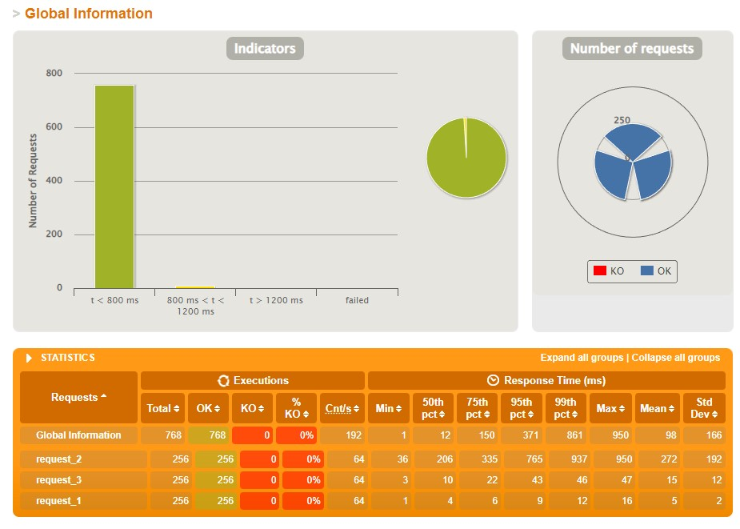
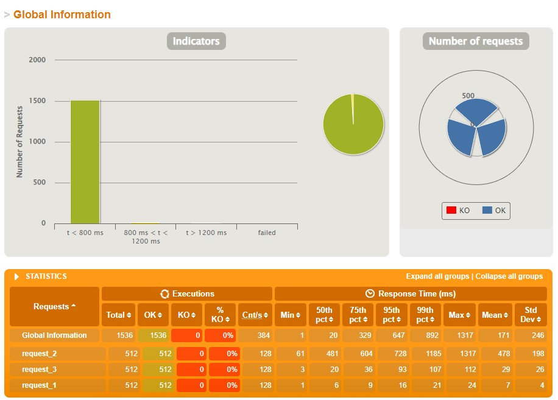

# aw10-final

### REPORT 报告

数据库使用AW06中用到的Amazon商品集，选用的是`all_beauty`分类，使用AW06项目中的`pos-batch (Renamed)`来导入数据库；

使用`Gatline`进行了2次压力测试，单个测试包含3个请求，分别进行256和512并发：

### Original README.md

Please develop a **fully functional** online purchase order system.

- It should have a superb collection of goods merchandises
- Customer can browse/search for merchandises, add selected one into his shopping cart and checkout to complete a transaction.
- User can get delivery status updates continuously.

The system should be of a **reactive architecture**, which means it should be 

-  Responsive: it should response to the user request timely.
-  Resilient: it should not be easily broken down.
-  Elastic: it should be flexible to scale out.
-  Message Driven: it should has loosely coupled components that communicates with each other asynchronously.

Please design tests/experiements to demostrate that your system fulfills such requirements as stated in [The Reactive Manifesto](https://www.reactivemanifesto.org)

**Submit your codes/documents/tests/experiements of your system.**
